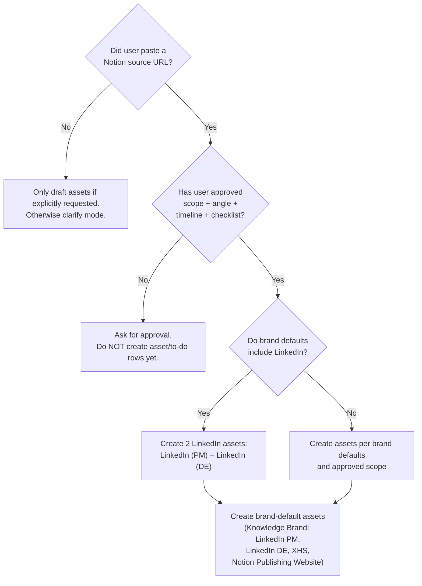

# 🧭 Quick Decision Tree

Use before writing anything.

## Decision rules in plain text

1. **Did the user paste a Notion source URL?**
   - **No** → Only draft assets if explicitly requested; otherwise clarify the mode.
   - **Yes** → Fetch the entry, detect brand, and ask the user to confirm.
2. **Has the user approved asset scope + angle + timeline + checklist?**
   - **No** → Ask for approval (do not create asset/to-do rows yet).
   - **Yes** → Create assets, then generate minimal to-dos.
3. **Do the brand defaults include LinkedIn?**
   - **Yes** → Create **two LinkedIn assets**: LinkedIn (PM) + LinkedIn (DE).
   - **No** → Create assets per brand defaults and approved scope.
4. **Knowledge Brand default assets:**
   - LinkedIn (PM)
   - LinkedIn (DE)
   - XHS
   - Notion Publishing Website
